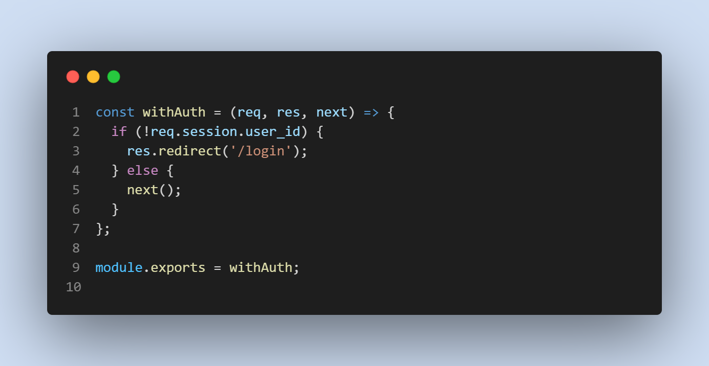
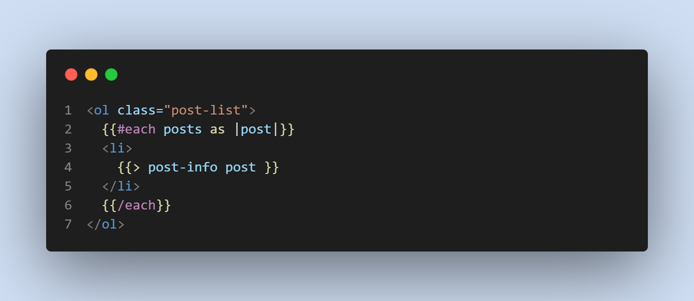

# Just-Tech News 

 
 

### Heroku:
.png)

## Description

 * Folder structure follows the Model-View-Controller paradigm.
 * Expres-handlebars is used to package handlebars.js for views
 * My SQL2 and Sequelize packages connect to a MySQL database for my models and create an Express.js API for controllers
 * Dotenv package is used for environment variables
 * Bcrypt package is used to hash passwords
 * Express session and connect session sequelize packages are used for authentication. 
 * Express session package stores the session data on the client in a cookie. 

# Table of contents
1. [Technologies used](#techologies-used)
2. [Features](#features)
3. [Usage](#usage)
4. [Credits](#credits)
5. [License](#license)

## Technologies used
* Javascript
* bcrypt
* Express
* Node
* Handlebars
* Sequelize
* mySQL
* Dotenv

## Features
* CMS style blog site
* Homepage which includes blog posts
* Sign up features using authentication
* Abilities to post and comment on the blog.
* Interaction with other users on the website.
* Website deployed to Heroku.

## Usage
* Installing necessary dependencies including Express, bcrypt, connect-session sequelize, dotenv, Express-Session, Handlebars, MySQL2, and Sequelize.
* For developers, run nodemon server.js.

* Screenshots:

## Credits

* [Travis Nichols](https://github.com/travnichols916/tech-news)

## License
[MIT License](https://choosealicense.com/licenses/mit/)

